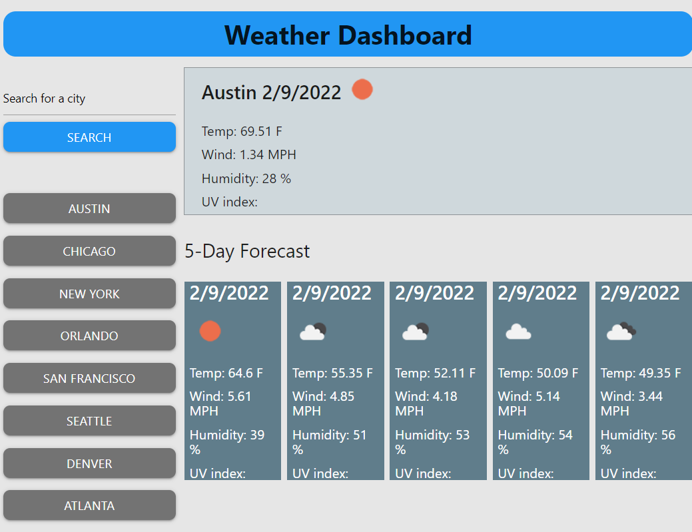

# Get the Weather

## Description
This web app will git you a quick 6 day view of the weather for what ever city in the world.

## Table of Contents
*[Description](#description) 
*[Installation](#installation) 
*[Usage](#usage) 

*[License](#license) 
*[Contributing](#contributing) 
*[Question](#questions)

## Installation
No instalation needed, just open the application and start enterind cities
https://rodney1100.github.io/Get-The-Weather/

## Usage
this product is biuld with node, javaScript, html and css

## License
All projects and packages in this repository are [MIT licensed](/LICENSE).

## Contribution & ## Questions
https://github.com/rodney1100
